# StudyMate AI

StudyMate AI is a full-stack AI-powered learning platform that transforms uploaded PDFs into reviewer notes, quizzes, and flashcards in a secure, mobile-responsive dashboard.

<p align="left">
	
	
	
	
	
	
</p>

## Table of Contents

- [Project Overview](#project-overview)
- [Screenshots](#screenshots)
- [Mobile Screenshots](#mobile-screenshots)
- [Key Features](#key-features)
- [Tech Stack](#tech-stack)
- [Architecture Highlights](#architecture-highlights)
- [Getting Started](#getting-started)
- [Environment Variables](#environment-variables)
- [AI Provider Modes](#ai-provider-modes)
- [Testing](#testing)
- [Deployment Checklist](#deployment-checklist)

## Project Overview

StudyMate AI was built to explore production-style full-stack development with secure authentication, database-backed user workflows, and AI-assisted content generation.

Users can:

1. Upload PDF study materials and extract text.
2. Generate study outputs as reviewer summaries, quizzes, and flashcards.
3. Save generated outputs and reopen them in dedicated study modes.
4. Reuse previously uploaded documents from a personal PDF library.
5. Access protected dashboard pages with secure session handling.
6. Track usage through analytics events.

## Screenshots

### Home

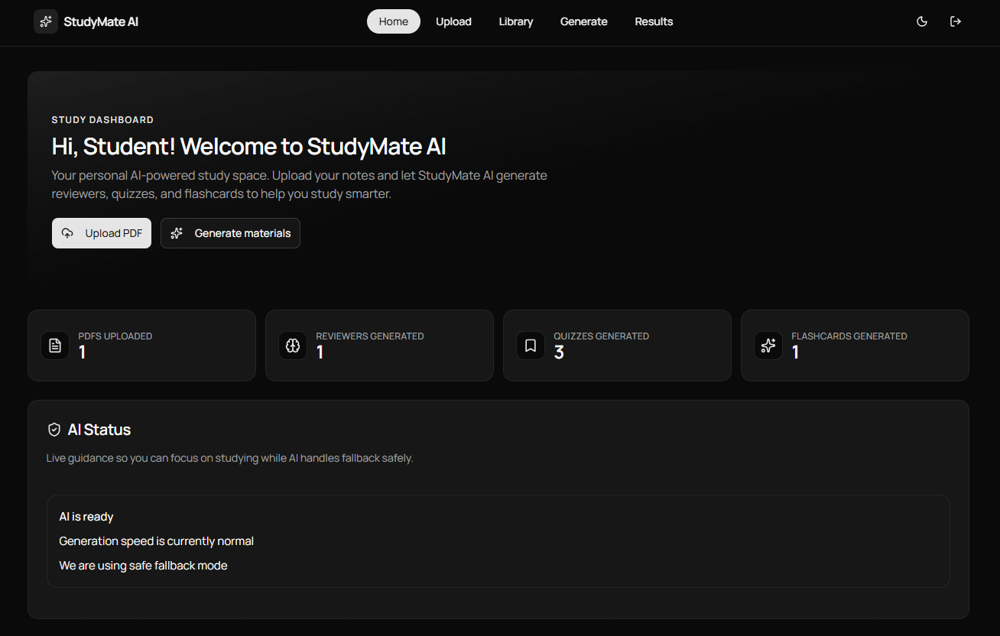
<br />
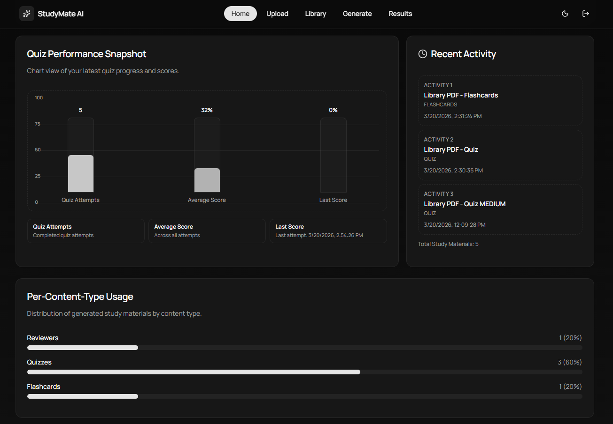

### Generate and Upload

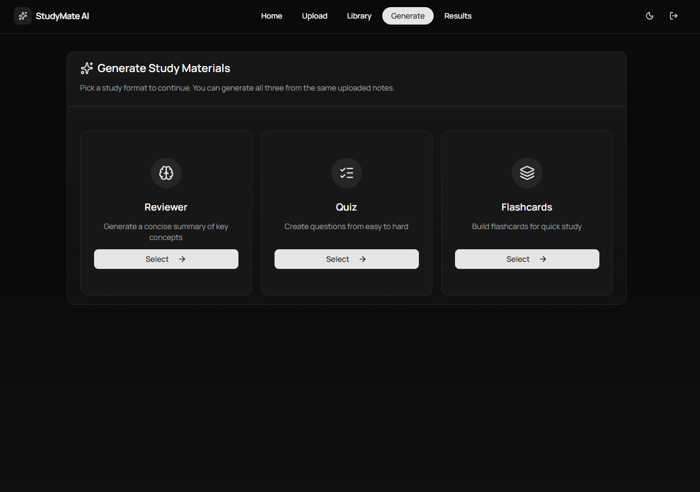
<br />
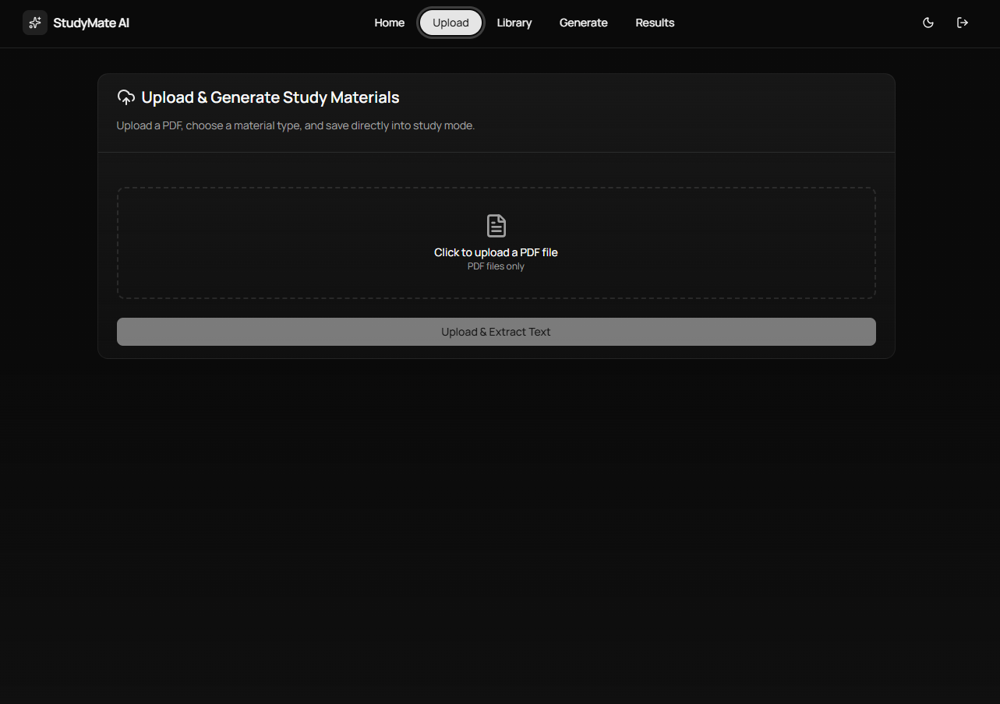

### Library

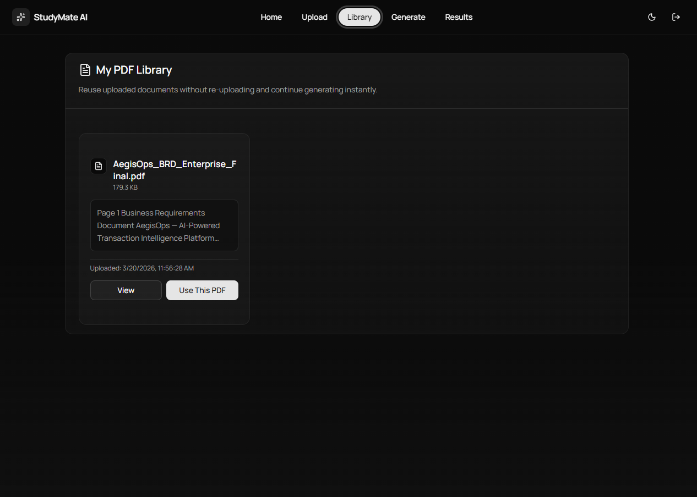
<br />
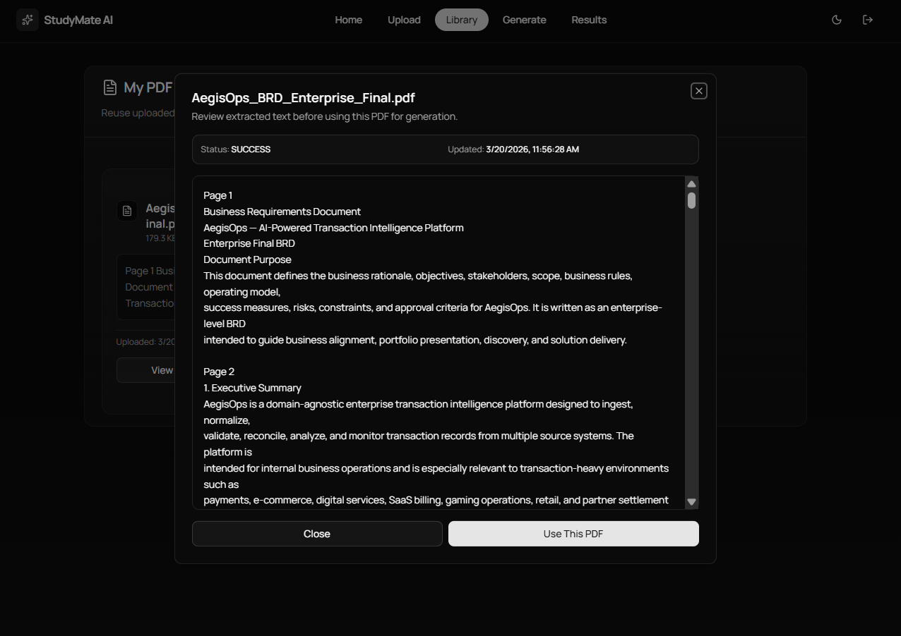

### Results Overview

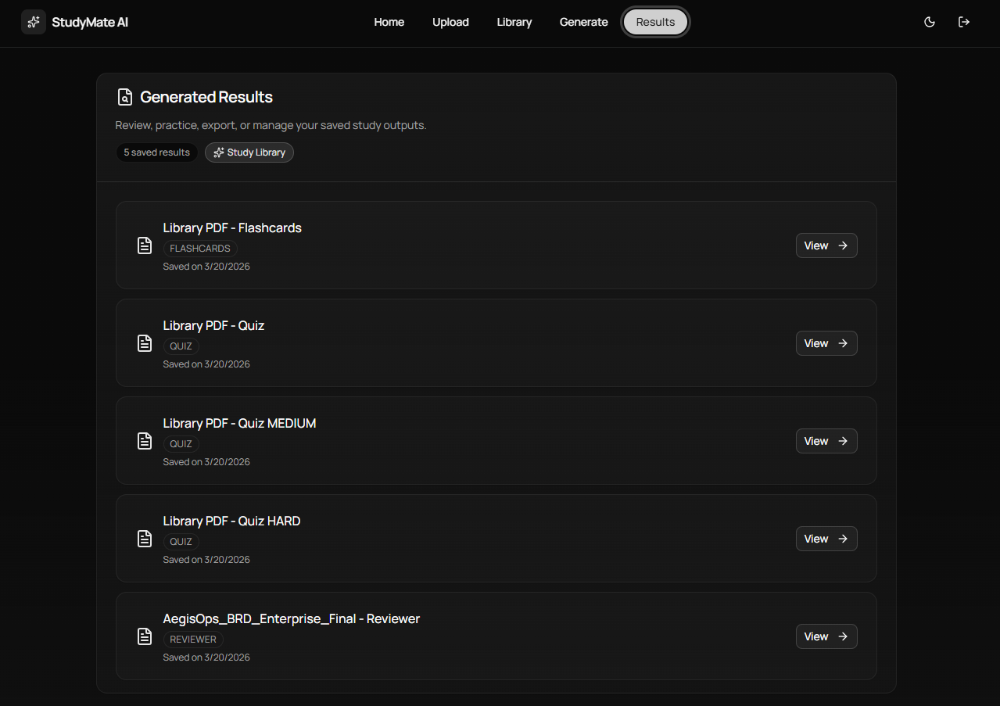

### Reviewer Result

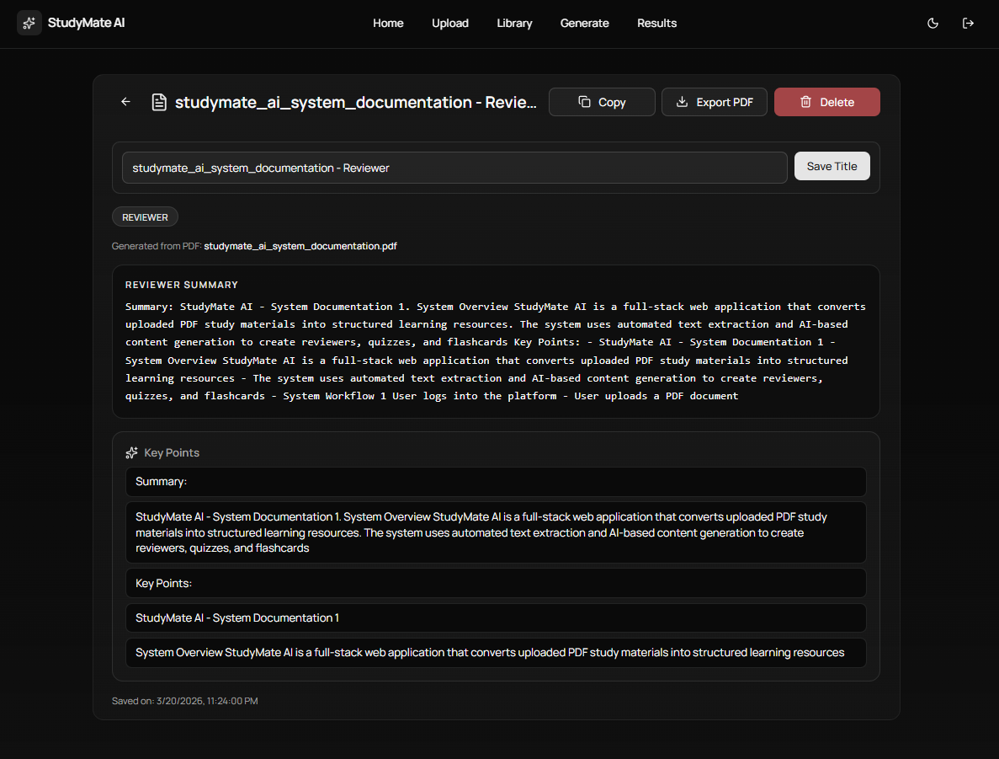

### Quiz Result

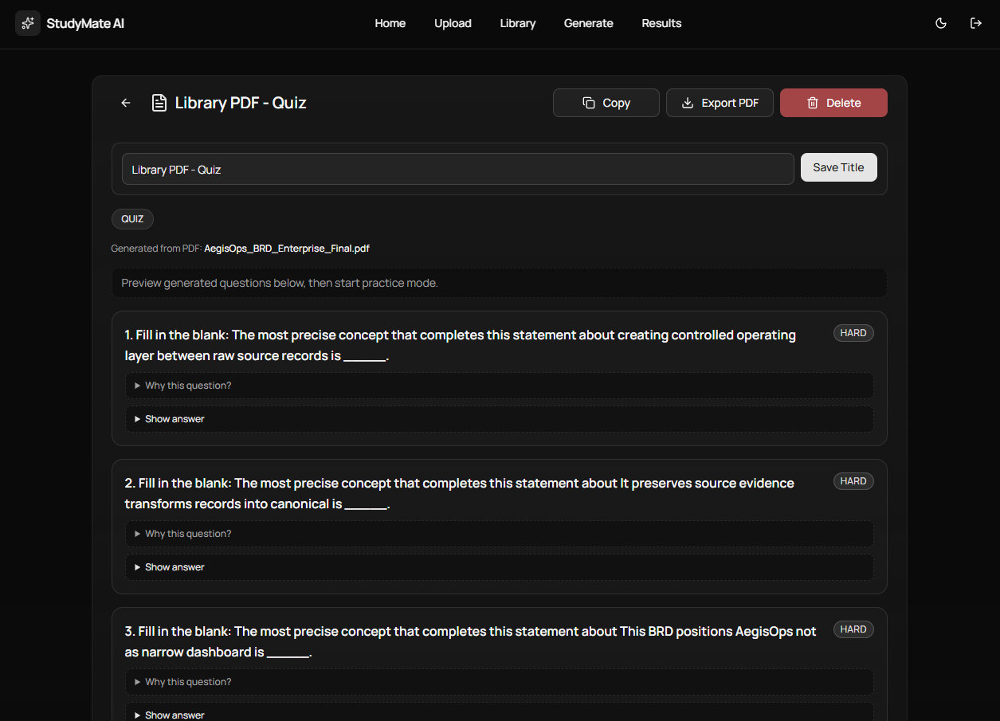
<br />
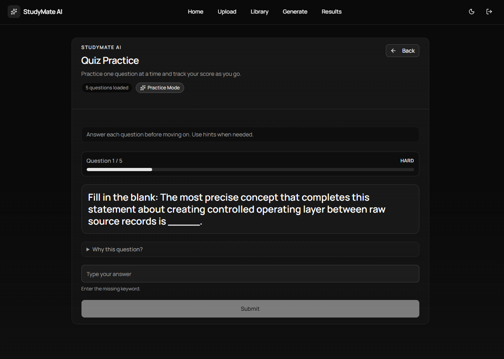

### Flashcards Result

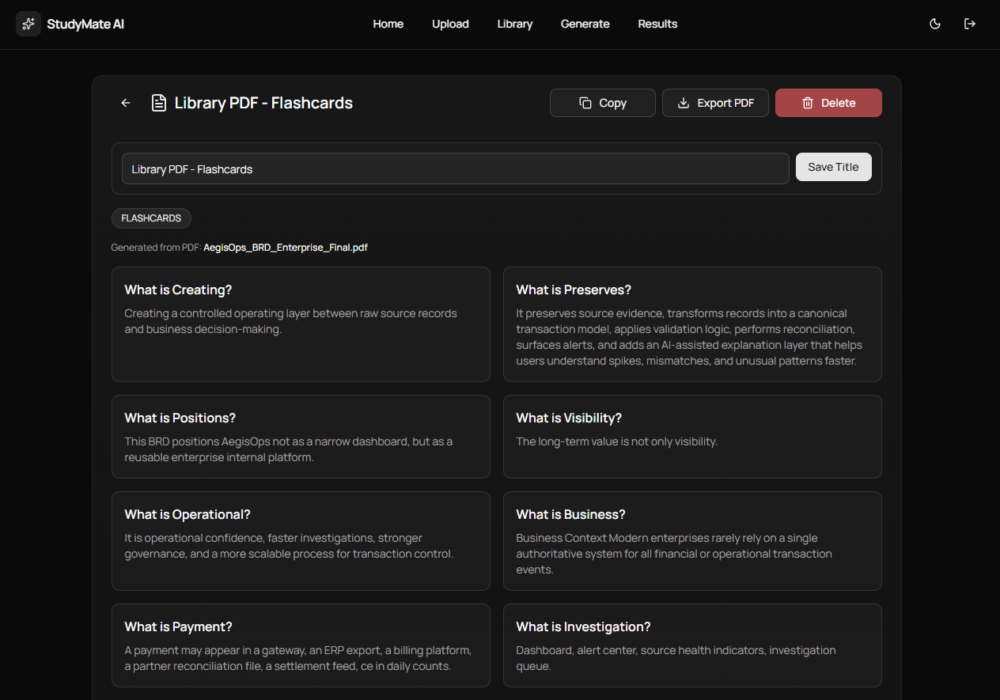
<br />
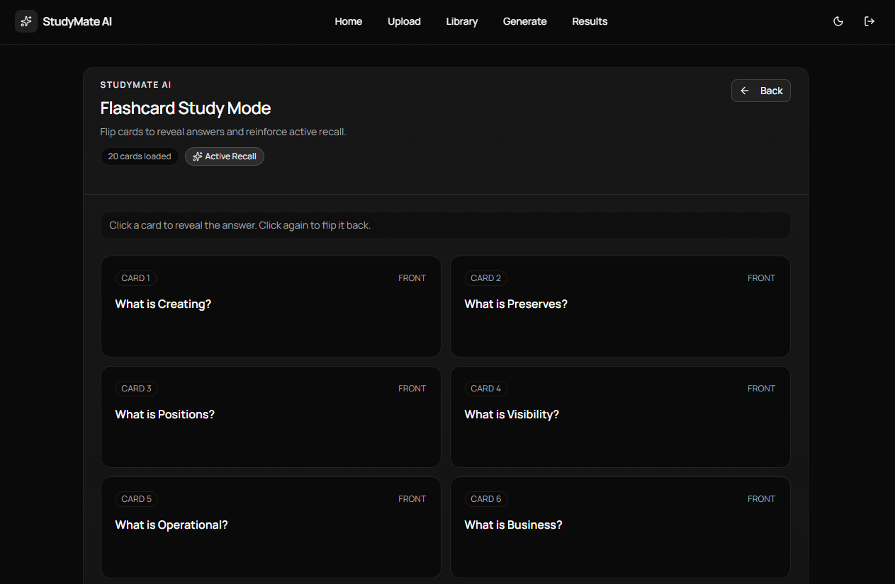

## Mobile Screenshots

<table>
	<tr>
		<td align="center" width="50%">
			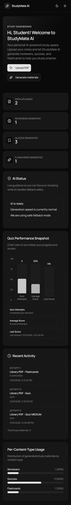
		</td>
		<td align="center" width="50%">
			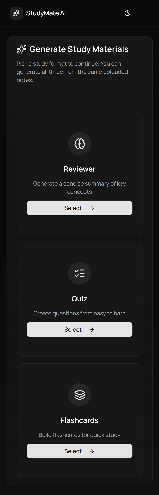
		</td>
	</tr>
	<tr>
		<td align="center" width="50%">
			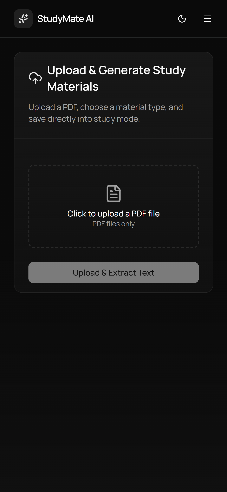
		</td>
		<td align="center" width="50%">
			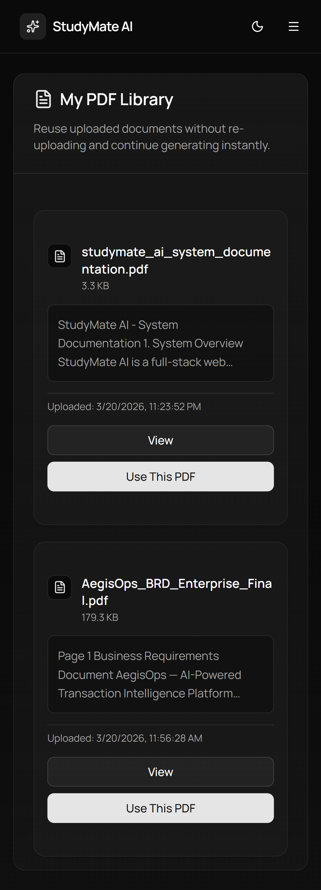
		</td>
	</tr>
	<tr>
		<td align="center" width="50%">
			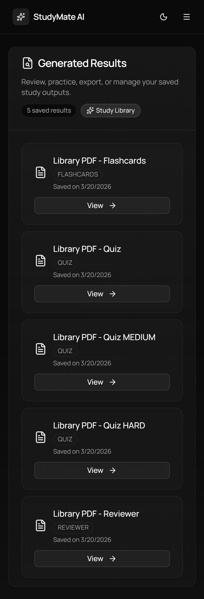
		</td>
		<td align="center" width="50%"></td>
	</tr>
</table>

## Key Features

- Email/password and Google OAuth sign-in with NextAuth.
- Cloudflare Turnstile bot protection on auth flows.
- Email verification code requirement before account creation.
- Protected dashboard routes and user-scoped data access.
- PDF upload, parsing, and recovery handling for malformed files.
- AI generation pipeline for reviewer, quiz, and flashcards.
- Quiz generation controls for difficulty, type, and item count.
- Personal PDF library with quick reuse and preview.
- Save, list, view, and delete generated study results.
- Responsive UI across desktop and mobile dashboards.

## Tech Stack

- Next.js 16 (App Router)
- React 18
- TypeScript 5
- Tailwind CSS 4
- MongoDB + Mongoose
- NextAuth.js
- pdf-parse
- Zod
- Vitest + Playwright
- OpenAI adapter (optional)
- Local LLM integration via Ollama (optional)

## Architecture Highlights

- Feature-based app routes under `app/(dashboard)` and `app/api`.
- API route separation for auth, PDF workflows, AI generation, and results.
- Shared modular UI shell components for consistent module pages.
- Result normalization and validation for stable rendering across versions.
- Config-driven AI provider selection with safe default mode.

## Getting Started

### Prerequisites

- Node.js v20 or later
- npm
- MongoDB Atlas (or compatible MongoDB instance)
- Google OAuth app credentials (for Google sign-in)
- SMTP provider credentials (for verification email delivery)

### Installation

```bash
git clone https://github.com/jesniemagaling/studymate-ai.git
cd studymate-ai
npm install
```

Create `.env.local` (see [Environment Variables](#environment-variables)), then run:

```bash
npm run dev
```

## Environment Variables

Add these in `.env.local`:

```bash
# Core auth and database
NEXTAUTH_URL=http://localhost:3000
NEXTAUTH_SECRET=replace-with-long-random-secret
MONGODB_URI=your-mongodb-uri

# Google OAuth
GOOGLE_CLIENT_ID=your-google-client-id
GOOGLE_CLIENT_SECRET=your-google-client-secret

# Cloudflare Turnstile
TURNSTILE_ENABLED=true
NEXT_PUBLIC_TURNSTILE_SITE_KEY=your-turnstile-site-key
TURNSTILE_SECRET_KEY=your-turnstile-secret-key

# SMTP mail delivery for registration verification code
SMTP_HOST=smtp.example.com
SMTP_PORT=587
SMTP_SECURE=false
SMTP_USER=your-smtp-username
SMTP_PASS=your-smtp-password
SMTP_FROM="StudyMate AI <no-reply@yourdomain.com>"

# AI provider defaults (safe / zero-cost)
AI_PIPELINE_VERSION=v2-free-local
AI_PROVIDER_MODE=deterministic
AI_ENABLE_LOCAL_PROVIDER=false
AI_ALLOW_PAID_PROVIDERS=false
AI_ENABLE_OPENAI_ADAPTER=false
```

Optional admin bootstrap:

```bash
DEFAULT_ADMIN_ENABLED=true
DEFAULT_ADMIN_EMAIL=admin@studymate.local
DEFAULT_ADMIN_PASSWORD=admin12345
DEFAULT_ADMIN_FIRST_NAME=System
DEFAULT_ADMIN_LAST_NAME=Admin
```

## AI Provider Modes

StudyMate AI supports three provider modes:

- `deterministic` (default): rule-based, zero-subscription generation.
- `local-first`: use local model first, then fallback to deterministic.
- `openai`: available only when explicitly enabled and paid providers are allowed.

Safety notes:

- Keep `AI_ALLOW_PAID_PROVIDERS=false` to avoid paid API usage.
- Set both `AI_ALLOW_PAID_PROVIDERS=true` and `AI_ENABLE_OPENAI_ADAPTER=true` to enable OpenAI mode.

## Testing

Run quality checks:

```bash
# Lint
npm run lint

# Unit + integration tests
npm run test

# Coverage
npm run test:coverage

# E2E tests
npm run test:e2e

# Production build
npm run build
```

CI workflows:

- `.github/workflows/ci.yml` runs lint, tests, and build on push/PR.
- `.github/workflows/e2e.yml` runs Playwright tests manually via workflow dispatch.

## Deployment Checklist

Before deploying:

1. Confirm all required environment variables are configured in production.
2. Verify Google OAuth callback URL and domain settings.
3. Ensure Turnstile keys match the deployed domain.
4. Run `npm run lint`, `npm run test`, and `npm run build`.
5. Test login, upload, generate, save, and study flows on mobile and desktop.

---

Built as a personal project to demonstrate practical full-stack engineering, secure auth design, and AI-assisted learning workflows.
