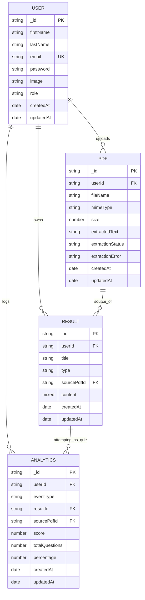

# StudyMate AI - Entity Relationship Diagram (ERD)

## 1. Overview

This ERD documents the core persisted entities currently used by StudyMate AI.

## 2. Mermaid ER Diagram

## 3. Entity Notes

1. `USER`
   1. Contains authentication profile information.
   2. `email` is unique.

2. `PDF`
   1. Stores uploaded file metadata and extracted text.
   2. `extractionStatus` values: `success`, `fallback`, `failed`.

3. `RESULT`
   1. Stores generated study outputs.
   2. `type` values: `reviewer`, `quiz`, `flashcards`.
   3. `sourcePdfId` links a generated result to its originating PDF when available.
   4. `content` is polymorphic:
   5. Reviewer: summary + key points.
   6. Quiz: questions/options/answers/difficulty/type/contextHint.
   7. Flashcards: front/back card list.

4. `ANALYTICS`
   1. Stores tracked learning events.
   2. Current event type: `quiz_attempt`.
   3. Includes scoring fields (`score`, `totalQuestions`, `percentage`) for performance metrics.

## 4. Relationship Rules

1. One `USER` can upload many `PDF` records.
2. One `USER` can create many `RESULT` records.
3. One `USER` can create many `ANALYTICS` records.
4. A `RESULT` may reference a source `PDF` through `sourcePdfId`.
5. Quiz attempt analytics can reference both `RESULT` and `PDF` for traceability.
