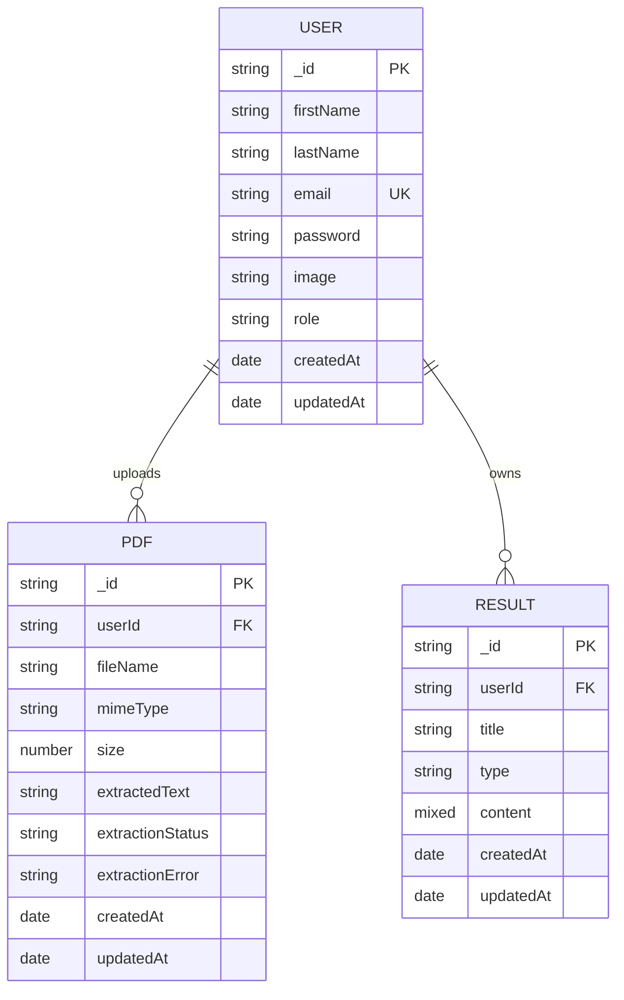

# StudyMate AI - Entity Relationship Diagram (ERD)

## 1. Overview

This ERD documents the core persisted entities currently used by StudyMate AI.

## 2. Mermaid ER Diagram

## 3. Entity Notes

1. `USER`
   1. Contains authentication profile information.
   2. `email` is unique.

2. `PDF`
   1. Stores uploaded file metadata and extracted text.
   2. `extractionStatus` values: `success`, `fallback`, `failed`.

3. `RESULT`
   1. Stores generated study outputs.
   2. `type` values: `reviewer`, `quiz`, `flashcards`.
   3. `content` is polymorphic:
      1. Reviewer: summary + key points.
      2. Quiz: questions/options/answers/difficulty/type/contextHint.
      3. Flashcards: front/back card list.

## 4. Relationship Rules

1. One `USER` can upload many `PDF` records.
2. One `USER` can create many `RESULT` records.
3. `PDF` and `RESULT` are user-scoped through `userId`.
4. No direct database FK exists between a specific `PDF` and `RESULT` (logical linkage is via workflow and title/source context).
